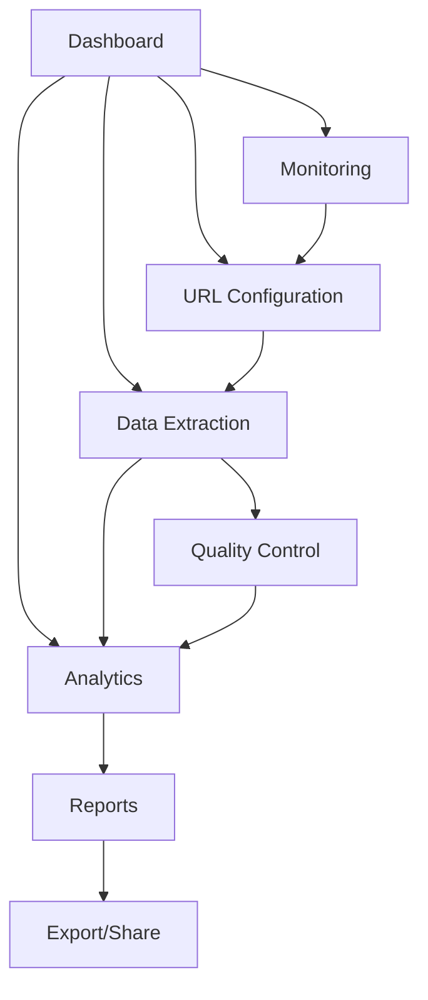

# Product Requirements Document (PRD)
## CRY-A-4MCP: Cryptocurrency AI Analysis Platform

## 1. Product Overview

CRY-A-4MCP is an advanced cryptocurrency analysis platform that leverages AI-powered web crawling and data extraction to provide real-time market insights, automated trading signals, and comprehensive risk assessment for cryptocurrency markets.

The platform solves the critical problem of fragmented cryptocurrency data across multiple sources by providing unified, AI-enhanced analysis capabilities for traders, analysts, and financial institutions seeking actionable market intelligence.

## 2. Core Features

### 2.1 User Roles

| Role | Registration Method | Core Permissions |
|------|---------------------|------------------|
| Analyst | Email registration + verification | Access to basic crawling, data visualization, and standard reports |
| Trader | Subscription upgrade | Advanced extraction strategies, real-time alerts, trading signals |
| Enterprise | Custom onboarding | Full API access, custom integrations, white-label solutions |
| Admin | Internal provisioning | System management, user administration, monitoring dashboards |

### 2.2 Feature Module

Our cryptocurrency analysis platform consists of the following main pages:

1. **Dashboard**: Real-time market overview, key metrics visualization, alert notifications, quick access navigation
2. **URL Configuration**: Web source management, crawler setup, extraction strategy configuration, scheduling controls
3. **Data Extraction**: Live crawling interface, extraction preview, quality assessment, result validation
4. **Analytics**: Market trend analysis, sentiment scoring, price correlation insights, predictive modeling
5. **Monitoring**: System health metrics, crawl performance tracking, error reporting, resource utilization
6. **Reports**: Automated report generation, custom analysis templates, export capabilities, sharing controls

### 2.3 Page Details

| Page Name | Module Name | Feature description |
|-----------|-------------|---------------------|
| Dashboard | Market Overview | Display real-time cryptocurrency prices, market cap changes, volume indicators with auto-refresh capabilities |
| Dashboard | Alert Center | Show critical market alerts, system notifications, and user-configured triggers with priority sorting |
| Dashboard | Quick Actions | Provide one-click access to start crawls, generate reports, and configure new data sources |
| URL Configuration | Source Management | Add, edit, delete cryptocurrency data sources with validation and categorization |
| URL Configuration | Crawler Settings | Configure extraction strategies (regular vs LLM), scheduling intervals, and retry policies |
| URL Configuration | Template Library | Access pre-built extraction templates for major crypto exchanges and news sources |
| Data Extraction | Live Crawler | Execute real-time web crawling with progress tracking and live preview of extracted data |
| Data Extraction | Quality Control | Validate extracted data quality, detect anomalies, and apply filtering rules |
| Data Extraction | Export Manager | Export crawled data in multiple formats (JSON, CSV, API) with custom field selection |
| Analytics | Trend Analysis | Generate market trend visualizations, correlation matrices, and statistical insights |
| Analytics | Sentiment Engine | Analyze news sentiment, social media buzz, and market mood indicators |
| Analytics | Predictive Models | Apply ML models for price prediction, volatility forecasting, and risk assessment |
| Monitoring | System Health | Display crawler performance metrics, API response times, and resource utilization |
| Monitoring | Error Tracking | Log and categorize extraction errors, failed requests, and system issues |
| Monitoring | Performance Analytics | Track extraction success rates, data quality scores, and processing speeds |
| Reports | Report Builder | Create custom analysis reports with drag-drop components and template selection |
| Reports | Automated Scheduling | Configure automated report generation and distribution via email or API |
| Reports | Sharing Hub | Manage report permissions, public links, and collaborative editing features |

## 3. Core Process

### Primary User Flow (Analyst/Trader)
1. User logs into dashboard and reviews market overview
2. Configures new data sources or modifies existing crawler settings
3. Initiates data extraction with chosen strategy (regular or LLM-based)
4. Monitors crawl progress and validates data quality
5. Analyzes extracted data using built-in analytics tools
6. Generates reports and sets up automated alerts
7. Exports insights or shares reports with team members

### Admin Flow
1. Admin accesses system monitoring dashboard
2. Reviews crawler performance and system health metrics
3. Manages user accounts and permissions
4. Configures system-wide settings and resource limits
5. Monitors error logs and resolves technical issues

## 4. User Interface Design

### 4.1 Design Style

- **Primary Colors**: Deep blue (#1a365d) for headers, accent green (#38a169) for success states
- **Secondary Colors**: Light gray (#f7fafc) for backgrounds, orange (#ed8936) for warnings
- **Button Style**: Rounded corners (8px radius) with subtle shadows and hover animations
- **Font**: Inter for headings (16-24px), system fonts for body text (14-16px)
- **Layout Style**: Card-based design with clean spacing, top navigation with sidebar for main sections
- **Icons**: Feather icons for consistency, cryptocurrency-specific icons for market data

### 4.2 Page Design Overview

| Page Name | Module Name | UI Elements |
|-----------|-------------|-------------|
| Dashboard | Market Overview | Grid layout with metric cards, real-time charts using Chart.js, color-coded indicators |
| Dashboard | Alert Center | List view with priority badges, timestamp sorting, expandable notification details |
| URL Configuration | Source Management | Table with inline editing, modal dialogs for complex configurations, drag-drop reordering |
| Data Extraction | Live Crawler | Progress bars, real-time logs in terminal-style interface, preview panels with syntax highlighting |
| Analytics | Trend Analysis | Interactive charts with zoom/pan, filter dropdowns, comparison toggles |
| Monitoring | System Health | Gauge charts for metrics, status indicators, expandable error details |
| Reports | Report Builder | Drag-drop interface, live preview, template gallery with thumbnails |

### 4.3 Responsiveness

Desktop-first design with mobile-adaptive breakpoints at 768px and 1024px. Touch-optimized interactions for mobile users including swipe gestures for navigation and tap-friendly button sizing (minimum