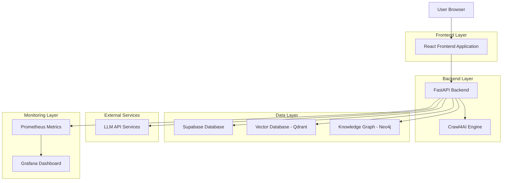
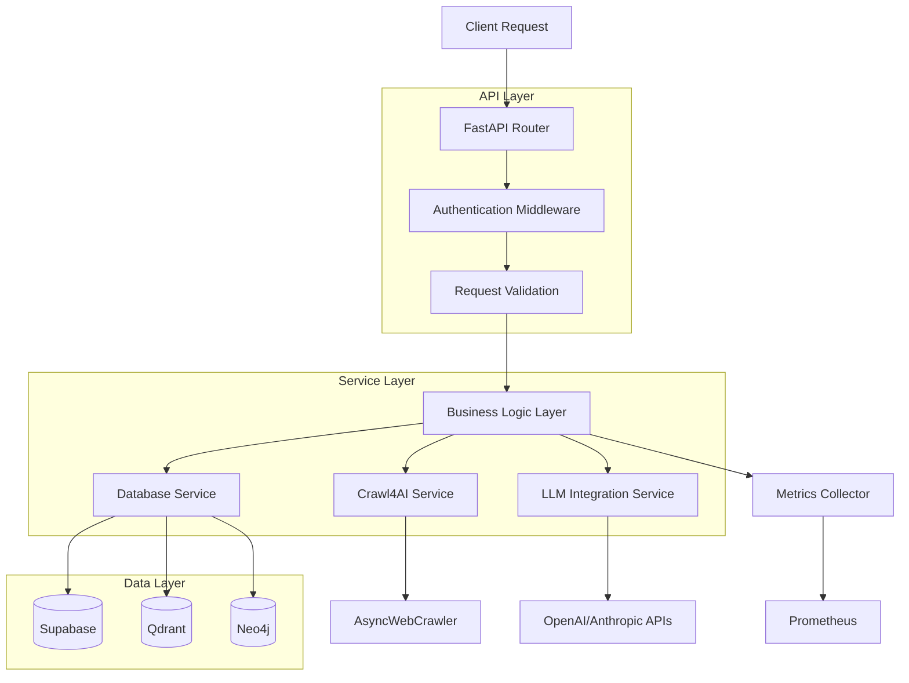
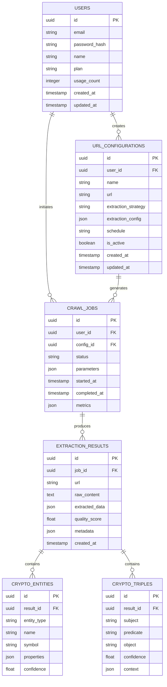

# Technical Architecture Document

## CRY-A-4MCP: Cryptocurrency AI Analysis Platform

## 1. Architecture Design



## 2. Technology Description

* **Frontend**: React\@18 + TypeScript + Tailwind CSS + Vite

* **Backend**: FastAPI + Python 3.11 + Uvicorn

* **AI Engine**: Crawl4AI 0.7.0 + AsyncWebCrawler

* **Database**: Supabase (PostgreSQL) + Qdrant (Vector) + Neo4j (Knowledge Graph)

* **Monitoring**: Prometheus + Grafana + Custom metrics exporter

* **Deployment**: Docker + Docker Compose + GitHub Actions

## 3. Route Definitions

| Route       | Purpose                                                    |
| ----------- | ---------------------------------------------------------- |
| /           | Dashboard home page with market overview and quick actions |
| /configure  | URL configuration and crawler setup interface              |
| /extract    | Live data extraction and crawling interface                |
| /analytics  | Market analysis and trend visualization tools              |
| /monitoring | System health and performance monitoring dashboard         |
| /reports    | Report generation and management interface                 |
| /login      | User authentication and session management                 |
| /profile    | User profile and subscription management                   |

## 4. API Definitions

### 4.1 Core API

**Crawl Execution**

```
POST /api/crawl
```

Request:

| Param Name           | Param Type | isRequired | Description                           |
| -------------------- | ---------- | ---------- | ------------------------------------- |
| url                  | string     | true       | Target URL to crawl                   |
| extraction\_strategy | string     | false      | Strategy type: 'regular' or 'llm'     |
| css\_selector        | string     | false      | CSS selector for targeted extraction  |
| wait\_for            | string     | false      | Element to wait for before extraction |

Response:

| Param Name | Param Type | Description                     |
| ---------- | ---------- | ------------------------------- |
| success    | boolean    | Extraction success status       |
| data       | object     | Extracted content and metadata  |
| metrics    | object     | Performance and quality metrics |

**LLM-Enhanced Crawl**

```
POST /api/crawl-llm
```

Request:

| Param Name         | Param Type | isRequired | Description                       |
| ------------------ | ---------- | ---------- | --------------------------------- |
| url                | string     | true       | Target URL to crawl               |
| extraction\_prompt | string     | true       | LLM extraction instructions       |
| model              | string     | false      | LLM model to use (default: gpt-4) |
| schema             | object     | false      | Expected output schema            |

Response:

| Param Name      | Param Type | Description                        |
| --------------- | ---------- | ---------------------------------- |
| success         | boolean    | Extraction success status          |
| extracted\_data | object     | LLM-processed content              |
| entities        | array      | Identified cryptocurrency entities |
| sentiment       | object     | Sentiment analysis results         |

**URL Configuration Management**

```
GET /api/configurations
POST /api/configurations
PUT /api/configurations/{id}
DELETE /api/configurations/{id}
```

**System Health**

```
GET /api/health
GET /metrics
```

## 5. Server Architecture Diagram



## 6. Data Model

### 6.1 Data Model Definition



### 6.2 Data Definition Language

**Users Table**

```sql
CREATE TABLE users (
    id UUID PRIMARY KEY DEFAULT gen_random_uuid(),
    email VARCHAR(255) UNIQUE NOT NULL,
    password_hash VARCHAR(255) NOT NULL,
    name VARCHAR(100) NOT NULL,
    plan VARCHAR(20) DEFAULT 'free' CHECK (plan IN ('free', 'premium', 'enterprise')),
    usage_count INTEGER DEFAULT 0,
    created_at TIMESTAMP WITH TIME ZONE DEFAULT NOW(),
    updated_at TIMESTAMP WITH TIME ZONE DEFAULT NOW()
);

-- Grant permissions
GRANT SELECT ON users TO anon;
GRANT ALL PRIVILEGES ON users TO authenticated;
```

**URL Configurations Table**

```sql
CREATE TABLE url_configurations (
    id UUID PRIMARY KEY DEFAULT gen_random_uuid(),
    user_id UUID NOT NULL,
    name VARCHAR(255) NOT NULL,
    url TEXT NOT NULL,
    extraction_strategy VARCHAR(50) DEFAULT 'regular' CHECK (extraction_strategy IN ('regular', 'llm')),
    extraction_config JSONB DEFAULT '{}',
    schedule VARCHAR(100),
    is_active BOOLEAN DEFAULT true,
    created_at TIMESTAMP WITH TIME ZONE DEFAULT NOW(),
    updated_at TIMESTAMP WITH TIME ZONE DEFAULT NOW()
);

CREATE INDEX idx_url_configurations_user_id ON url_configurations(user_id);
CREATE INDEX idx_url_configurations_active ON url_configurations(is_active);

GRANT SELECT ON url_configurations TO anon;
GRANT ALL PRIVILEGES ON url_configurations TO authenticated;
```

**Crawl Jobs Table**

```sql
CREATE TABLE crawl_jobs (
    id UUID PRIMARY KEY DEFAULT gen_random_uuid(),
    user_id UUID NOT NULL,
    config_id UUID,
    status VARCHAR(50) DEFAULT 'pending' CHECK (status IN ('pending', 'running', 'completed', 'failed')),
    parameters JSONB DEFAULT '{}',
    started_at TIMESTAMP WITH TIME ZONE,
    completed_at TIMESTAMP WITH TIME ZONE,
    metrics JSONB DEFAULT '{}',
    created_at TIMESTAMP WITH TIME ZONE DEFAULT NOW()
);

CREATE INDEX idx_crawl_jobs_user_id ON crawl_jobs(user_id);
CREATE INDEX idx_crawl_jobs_status ON crawl_jobs(status);
CREATE INDEX idx_crawl_jobs_created_at ON crawl_jobs(created_at DESC);

GRANT SELECT ON crawl_jobs TO anon;
GRANT ALL PRIVILEGES ON crawl_jobs TO authenticated;
```

**Extraction Results Table**

```sql
CREATE TABLE extraction_results (
    id UUID PRIMARY KEY DEFAULT gen_random_uuid(),
    job_id UUID NOT NULL,
    url TEXT NOT NULL,
    raw_content TEXT,
    extracted_data JSONB DEFAULT '{}',
    quality_score FLOAT DEFAULT 0.0,
    metadata JSONB DEFAULT '{}',
    created_at TIMESTAMP WITH TIME ZONE DEFAULT NOW()
);

CREATE INDEX idx_extraction_results_job_id ON extraction_results(job_id);
CREATE INDEX idx_extraction_results_quality_score ON extraction_results(quality_score DESC);
CREATE INDEX idx_extraction_results_created_at ON extraction_results(created_at DESC);

GRANT SELECT ON extraction_results TO anon;
GRANT ALL PRIVILEGES ON extraction_results TO authenticated;
```

**Initial Data**

```sql
-- Insert sample URL configurations
INSERT INTO url_configurations (user_id, name, url, extraction_strategy, extraction_config) VALUES
('00000000-0000-0000-0000-000000000001', 'CoinDesk News', 'https://www.coindesk.com', 'llm', '{"prompt": "Extract cryptocurrency news headlines and sentiment"}'),
('00000000-0000-0000-0000-000000000001', 'Binance API', 'https://api.binance.com/api/v3/ticker/24hr', 'regular', '{"css_selector": "body"}');
```

