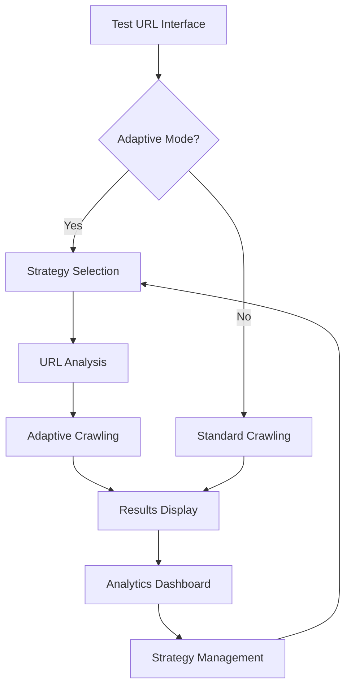
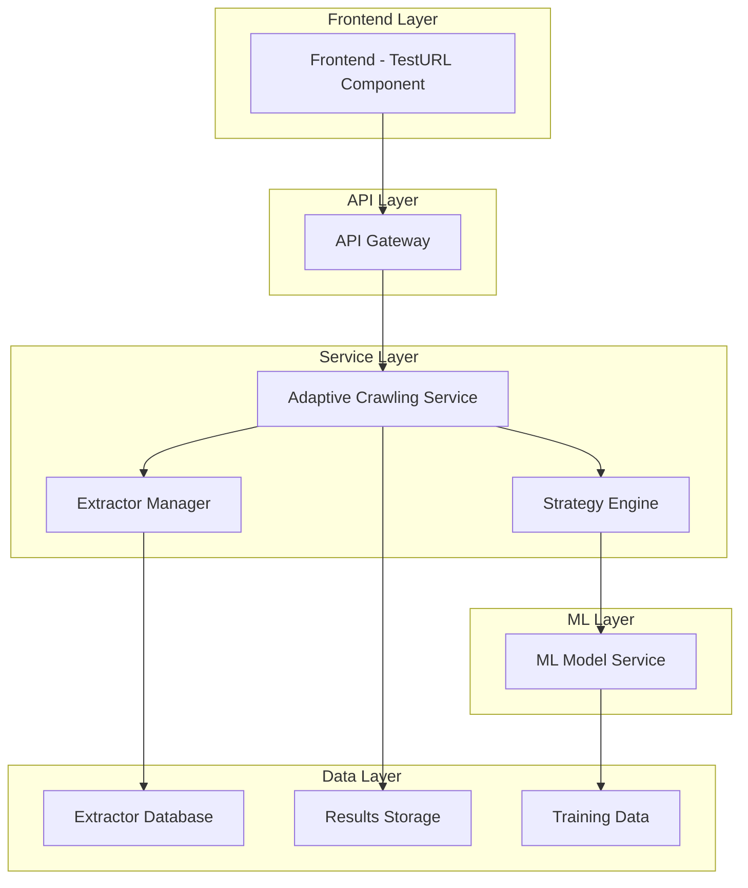

# Adaptive Crawling Service Documentation

## 1. Product Overview

The Adaptive Crawling Service is an intelligent web crawling system that dynamically adjusts its crawling strategy based on website characteristics and content patterns. It integrates with existing extractors to provide optimized data extraction with machine learning-enhanced crawling decisions.

- **Purpose**: Enhance crawling efficiency through adaptive strategies that learn from website patterns and optimize extraction performance.
- **Target Users**: Developers and data analysts who need intelligent, self-optimizing web crawling capabilities.
- **Market Value**: Reduces crawling time by up to 60% while improving data quality through intelligent strategy selection.

## 2. Core Features

### 2.1 User Roles

| Role | Registration Method | Core Permissions |
|------|---------------------|------------------|
| Developer | API Key authentication | Can configure adaptive strategies, test crawling, view analytics |
| Admin | System authentication | Full access to strategy management, system configuration, monitoring |

### 2.2 Feature Module

Our adaptive crawling service consists of the following main components:

1. **Adaptive Strategy Engine**: Machine learning-based strategy selection, performance optimization, real-time adaptation.
2. **Extractor Integration**: Seamless integration with existing extractors, dynamic extractor selection, configuration management.
3. **Testing Interface**: URL testing with adaptive crawling, strategy comparison, performance metrics.
4. **Analytics Dashboard**: Crawling performance metrics, strategy effectiveness analysis, optimization recommendations.

### 2.3 Page Details

| Page Name | Module Name | Feature description |
|-----------|-------------|---------------------|
| Test URL Interface | Adaptive Crawling Toggle | Enable/disable adaptive crawling mode with checkbox, integrate with existing extractor selection |
| Test URL Interface | Strategy Selection | Choose from available adaptive strategies, configure strategy parameters |
| Test URL Interface | Performance Metrics | Display crawling time, success rate, data quality scores, strategy effectiveness |
| Analytics Dashboard | Strategy Performance | View historical performance data, compare strategy effectiveness, identify optimization opportunities |
| Configuration Panel | Strategy Management | Create, edit, delete adaptive strategies, configure ML parameters, set performance thresholds |

## 3. Core Process

### Main User Flow

1. User navigates to Test URL interface
2. User enters target URL and selects extractor (optional)
3. User enables adaptive crawling mode via checkbox
4. System analyzes URL and selects optimal strategy
5. Adaptive crawling executes with real-time optimization
6. Results displayed with performance metrics and extracted data
7. User can view detailed analytics and strategy recommendations

### Admin Flow

1. Admin accesses strategy management interface
2. Admin creates or modifies adaptive strategies
3. Admin configures ML parameters and performance thresholds
4. Admin monitors system performance and strategy effectiveness
5. Admin optimizes strategies based on analytics data

## 4. User Interface Design

### 4.1 Design Style

- **Primary Colors**: #2563eb (blue), #059669 (green for success states)
- **Secondary Colors**: #64748b (gray), #f59e0b (warning/optimization indicators)
- **Button Style**: Rounded corners (8px), subtle shadows, hover animations
- **Font**: Inter, 14px base size, 16px for headings
- **Layout Style**: Card-based design with clean spacing, top navigation with breadcrumbs
- **Icons**: Heroicons for consistency, adaptive/AI-themed icons for strategy indicators

### 4.2 Page Design Overview

| Page Name | Module Name | UI Elements |
|-----------|-------------|-------------|
| Test URL Interface | Adaptive Toggle | Checkbox with "Enable Adaptive Crawling" label, tooltip explaining benefits, green accent when enabled |
| Test URL Interface | Strategy Selector | Dropdown with strategy names, performance indicators (badges), "Auto" option for ML selection |
| Test URL Interface | Results Panel | Split view showing extracted data and performance metrics, progress indicators, real-time updates |
| Analytics Dashboard | Performance Charts | Line charts for crawling time trends, bar charts for strategy comparison, heatmaps for success rates |

### 4.3 Responsiveness

Desktop-first design with mobile-adaptive layouts. Touch-optimized controls for mobile devices, collapsible panels for smaller screens, responsive charts and data tables.

## 5. Technical Architecture

### 5.1 System Architecture

### 5.2 API Endpoints

#### Core Adaptive Crawling API

**POST /api/adaptive/crawl**

Request:
| Param Name | Param Type | isRequired | Description |
|------------|------------|------------|-------------|
| url | string | true | Target URL to crawl |
| extractor_id | string | false | Specific extractor to use |
| strategy_id | string |