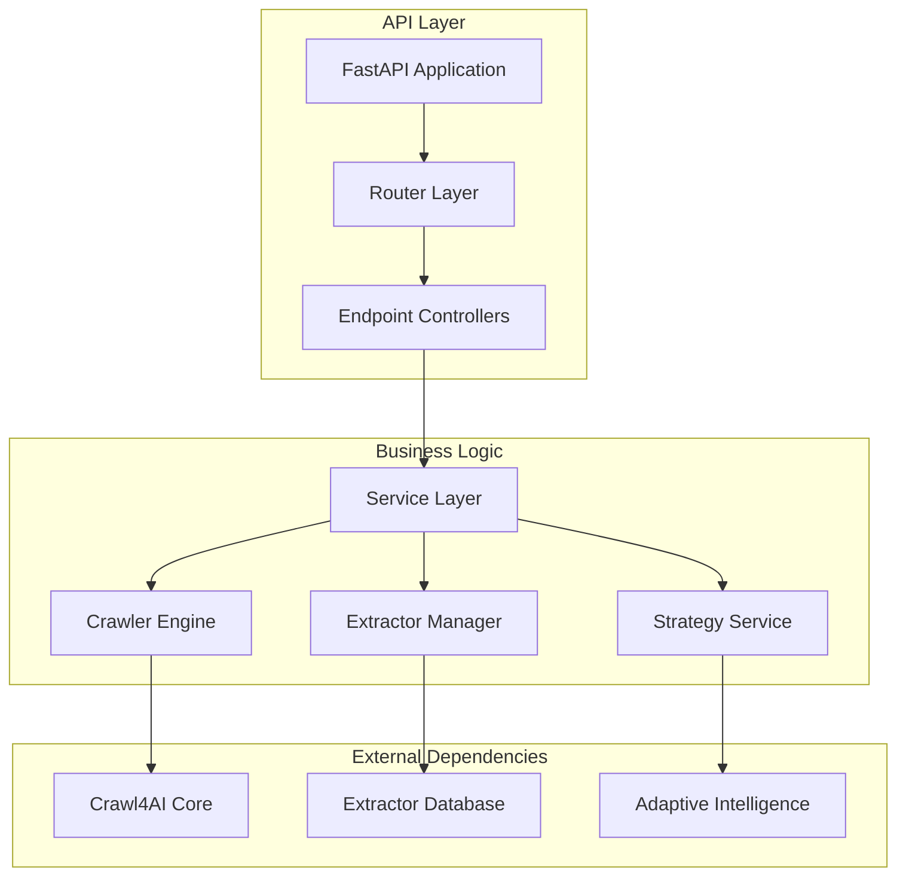
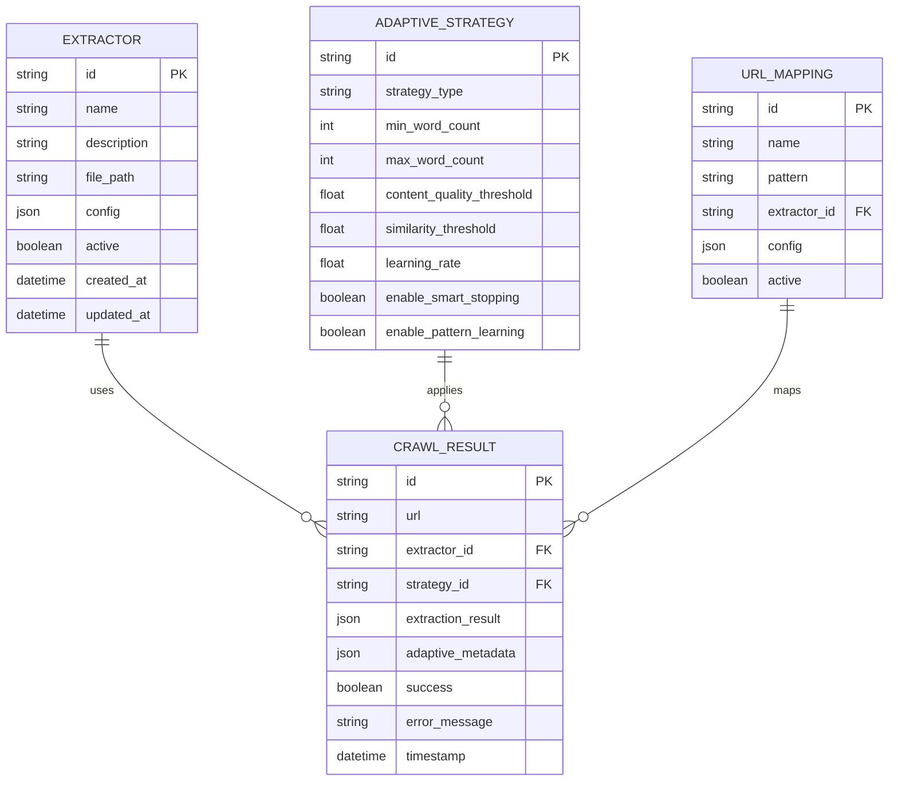

# Adaptive Crawling Technical Architecture

## 1. Architecture Design

```mermaid
graph TD
    A[TestURL Component] --> B{Adaptive Crawling Enabled?}
    B -->|Yes| C[/api/adaptive/crawl]
    B -->|No| D[/api/test-url]
    
    C --> E[AdaptiveCrawlRequest]
    E --> F[CryptoCrawler.crawl_with_adaptive_intelligence]
    F --> G[Adaptive Strategy Service]
    F --> H[Extractor Integration]
    
    D --> I[Standard Test Endpoint]
    I --> J[CryptoCrawler.crawl]
    
    G --> K[Strategy Analysis]
    H --> L[Content Extraction]
    K --> M[AdaptiveCrawlResponse]
    L --> M
    
    subgraph "Frontend Layer"
        A
        B
    end
    
    subgraph "API Layer"
        C
        D
        E
        I
    end
    
    subgraph "Service Layer"
        F
        G
        H
        J
    end
    
    subgraph "Processing Layer"
        K
        L
    end
```

## 2. Technology Description

- **Frontend**: React@18 + TypeScript + TailwindCSS
- **Backend**: FastAPI + Python 3.11
- **Crawling Engine**: Crawl4AI v0.7.0 with adaptive intelligence
- **Database**: SQLite (for extractors and configurations)
- **Validation**: Pydantic models

## 3. Route Definitions

| Route | Purpose |
|-------|----------|
| `/test-url` | TestURL page with adaptive crawling options |
| `/extractors` | Extractor management page |
| `/crawlers` | Crawler configuration page |

## 4. API Definitions

### 4.1 Adaptive Crawling API

**Endpoint**: `POST /api/adaptive/crawl`

**Request Model**:
```typescript
interface AdaptiveCrawlRequest {
  url: string;
  strategy_type?: 'statistical' | 'embedding' | 'hybrid';
  min_word_count?: number;
  max_word_count?: number;
  content_quality_threshold?: number;
  similarity_threshold?: number;
  learning_rate?: number;
  enable_smart_stopping?: boolean;
  enable_pattern_learning?: boolean;
  extractor_id?: string;
  extractor_config?: Record<string, any>;
  llm_config?: {
    provider: string;
    model: string;
    api_key: string;
    temperature: number;
    max_tokens: number;
    timeout: number;
  };
  instruction?: string;
  schema?: Record<string, any>;
}
```

**Response Model**:
```typescript
interface AdaptiveCrawlResponse {
  success: boolean;
  url: string;
  extraction_result?: any;
  adaptive_metadata?: {
    patterns_learned: string[];
    content_quality_score: number;
    adaptation_applied: boolean;
    stopping_reason: string;
    statistical_metrics: Record<string, any>;
    strategy_type: string;
    learning_enabled: boolean;
    smart_stopping_enabled: boolean;
  };
  metadata?: {
    extractor_used?: string;
    model_used?: string;
    extraction_time_ms: number;
  };
  error_message?: string;
  timestamp: string;
}
```

### 4.2 Standard Test API

**Endpoint**: `POST /api/test-url`

**Request Model**:
```typescript
interface TestUrlRequest {
  url: string;
  extractor_id?: string;
  llm_config?: {
    provider: string;
    model: string;
    api_key: string;
    temperature: number;
    max_tokens: number;
    timeout: number;
  };
  instruction?: string;
  schema?: Record<string, any>;
}
```

## 5. Server Architecture Diagram



## 6. Data Model

### 6.1 Data Model Definition



### 6.2 Data Definition Language

**Adaptive Strategy Configuration Table**:
```sql
CREATE TABLE adaptive_strategies (
    id TEXT PRIMARY KEY DEFAULT (lower(hex(randomblob(16)))),
    strategy_type TEXT NOT NULL CHECK (strategy_type IN ('statistical', 'embedding', 'hybrid')),
    min_word_count INTEGER DEFAULT 100,
    max_word_count INTEGER DEFAULT 5000,
    content_quality_threshold REAL DEFAULT 0.7,
    similarity_threshold REAL DEFAULT 0.8,
    learning_rate REAL DEFAULT 0.1,
    enable_smart_stopping BOOLEAN DEFAULT TRUE,
    enable_pattern_learning BOOLEAN DEFAULT TRUE,
    created_at TIMESTAMP DEFAULT CURRENT_TIMESTAMP,
    updated_at TIMESTAMP DEFAULT CURRENT_TIMESTAMP
);

CREATE INDEX idx_adaptive_strategies_type ON adaptive_strategies(strategy_type);
```

**Crawl Results Table**:
```sql
CREATE TABLE crawl_results (
    id TEXT PRIMARY KEY DEFAULT (lower(hex(randomblob(16)))),
    url TEXT NOT NULL,
    extractor_id TEXT,
    strategy_id TEXT,
    extraction_result JSON,
    adaptive_metadata JSON,
    success BOOLEAN NOT NULL,
    error_message TEXT,
    response_time_ms INTEGER,
    timestamp TIMESTAMP DEFAULT CURRENT_TIMESTAMP,
    FOREIGN KEY (extractor_id) REFERENCES extractors(id),
    FOREIGN KEY (strategy_id) REFERENCES adaptive_strategies(id)
);

CREATE INDEX idx_crawl_results_url ON crawl_results(url);
CREATE INDEX idx_crawl_results_timestamp ON crawl_results(timestamp DESC);
CREATE INDEX idx_crawl_results_success ON crawl_results(success);
```

**Initial Data**:
```sql
-- Default adaptive strategy configurations
INSERT INTO adaptive_strategies (strategy_type, min_word_count, max_word_count) VALUES
('statistical', 100, 5000),
('embedding', 200, 8000),
('hybrid', 150, 6000);
```

## 7. Component Integration Flow

### 7.1 Adaptive Crawling Flow

1. **User Input**: User enters URL and selects adaptive crawling
2. **UI Validation**: Frontend validates form inputs
3. **API Request**: POST to `/api/adaptive/crawl` with configuration
4. **Strategy Selection**: Backend determines optimal strategy
5. **Crawler Execution**: Crawl4AI performs adaptive crawling
6. **Extractor Application**: If extractor_id provided, apply extraction
7. **Result Processing**: Format and return adaptive metadata
8. **UI Display**: Frontend displays results with adaptive insights

### 7.2 Error Handling Strategy

```typescript
// Frontend error handling
try {
  const response = await fetch('/api/adaptive/crawl', {
    method: 'POST',
    headers: { 'Content-Type': 'application/json' },
    body: JSON.stringify(requestBody)
  });
  
  if (!response.ok) {
    const errorData = await response.json();
    throw new Error(errorData.detail || `HTTP ${response.status}`);
  }
  
  const result = await response.json();
  setAdaptiveResult(result);
} catch (error) {
  setError(error.message);
  // Fallback to standard crawling if adaptive fails
  if (allowFallback) {
    await performStandardCrawling();
  }
}
```

## 8. Performance Considerations

### 8.1 Caching Strategy
- Cache adaptive strategy configurations
- Store learned patterns for domain optimization
- Implement result caching for repeated URLs

### 8.2 Monitoring Metrics
- Adaptive crawling success rate
- Strategy effectiveness scores
- Response time comparisons (adaptive vs standard)
- Pattern learning accuracy

### 8.3 Scalability Design
- Async processing for long-running adaptive operations
- Queue system for batch adaptive crawling
- Database indexing for performance optimization

## 9. Security Considerations

### 9.1 Input Validation
- URL validation and sanitization
- Strategy parameter bounds checking
- LLM API key encryption in transit

### 9.2 Rate Limiting
- Adaptive crawling rate limits per user
- Strategy learning rate controls
- API endpoint throttling

### 9.3 Data Protection
- Secure storage of API keys
- Anonymization of crawl